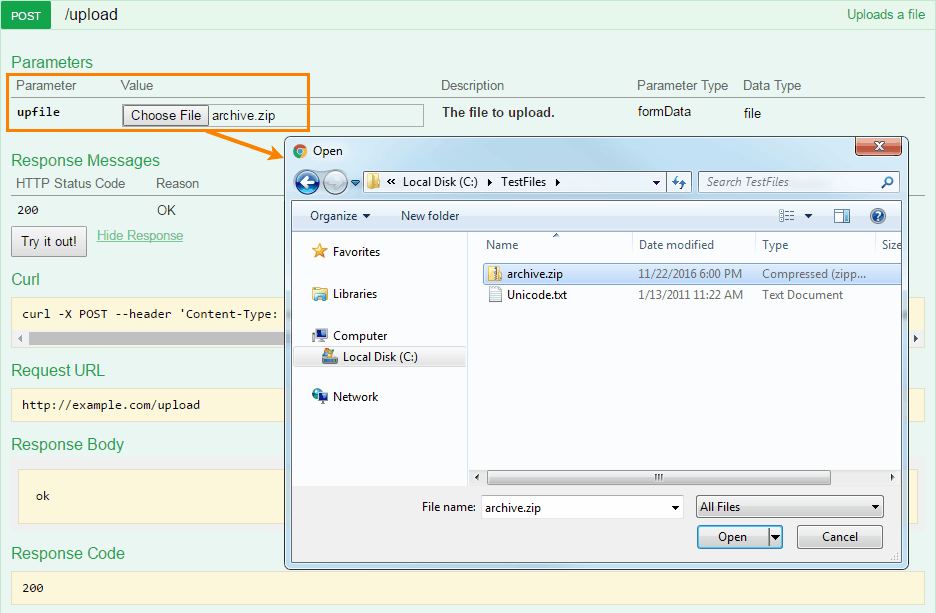

## File Upload

Swagger 2.0 supports file uploads sent with `Content-Type: multipart/form-data`. That is, your API server must consume `multipart/form-data` for this operation:

```
consumes:
   - mulitpart/form-data
```

The operation payload is defined using `formData` parameters (not body parameters). The file parameter must have `type: file`:

```
paths:
   /upload:
     post:
       summary: Uploads a file.
       consumes:
         - multipart/form-data
       parameters:
         - in: formData
           name: upfile
           type: file
           description: The file to upload.
```

This definition corresponds to the following HTTP request:

```
POST /upload
Host: example.com
Content-Type: multipart/form-data; boundary=----WebKitFormBoundaryqzByvokjOTfF9UwD
Content-Length: 204

------WebKitFormBoundaryqzByvokjOTfF9UwD
Content-Disposition: form-data; name="upfile"; filename="example.txt"
Content-Type: text/plain

File contents go here.

------WebKitFormBoundaryqzByvokjOTfF9UwD--
```

Swagger UI displays file parameters using a file input control, allowing the users to browse for a local file to upload.



### Upload a File + Other Data

File parameters can be sent along with other form data:

```
      parameters:
        - in: formData
          name: upfile
          type: file
          required: true
          description: The file to upload.
        - in: formData
          name: note
          type: string
          required: false
          description: Description of file contents.
```

The corresponding HTTP request payload will include multiple parts:

```
POST /upload
Host: example.com
Content-Type: multipart/form-data; boundary=----WebKitFormBoundaryqzByvokjOTfF9UwD
Content-Length: 332

------WebKitFormBoundaryqzByvokjOTfF9UwD
Content-Disposition: form-data; name="upfile"; filename="example.txt"
Content-Type: text/plain

File contents go here.

------WebKitFormBoundarysKk4Z8KcYfU3u6Cs
Content-Disposition: form-data; name="note"

Uploading a file named "example.txt"

------WebKitFormBoundaryqzByvokjOTfF9UwD--
```

### Multiple Upload

You can have several named file parameters, each defined individually:

```
      parameters:
        - in: formData
          name: upfile1
          type: file
          required: true
        - in: formData
          name: upfile2
          type: file
          required: false
        - in: formData
          name: upfile3
          type: file
          required: false
```

However, uploading an arbitrary number of files (an array of files) is not supported. There is an open feature request at [https://github.com/OAI/OpenAPI-Specification/issues/254](https://github.com/OAI/OpenAPI-Specification/issues/254). For now, you can use a binary string array as a workaround for uploading an arbitrary number of files:

```
type: array
items:
  type: string
  format: binary
```

Note that this will not produce the file upload interface in Swagger UI.

### FAQ

**Can I upload files via PUT?**

Swagger supports file upload requests with `Content-Type: multipart/form-data`, but does not care about the HTTP method. You can use POST, PUT or any other method, provided that the operation consumes `multipart/form-data`.

Uploads where the payload is just the raw file contents are not supported, because they are not `multipart/form-data`. That is, Swagger does not support something like:

```
curl --upload-file archive.zip http://example.com/upload
```

Note also that file uploading in Swagger UI only works for POST requests, because HTML forms in browsers support GET and POST methods only.

**Can I define the Content-Type for uploaded files?**

This is currently not supported. You can say that an operation accepts a file, but you cannot say that this file is of a specific type or structure. There is an open feature request at [https://github.com/OAI/OpenAPI-Specification/issues/222](https://github.com/OAI/OpenAPI-Specification/issues/222).

For now, [vendor extensions](swagger-extensions.md) can be used to extend this functionality, for example:

```
- in: formData
  name: zipfile
  type: file
  description: Contents of the ZIP file.
  x-mimetype: application/zip
```
