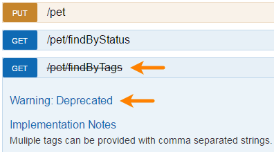

## Paths and Operations

In Swagger terms, **paths** are the endpoints (resources) that your API exposes, such as `/users` or `/reports/summary`, and **operations** are the HTTP methods used to manipulate these paths, such as GET, POST or DELETE.

### Paths

API paths and operations are defined in the global `paths` section of the API specification. 

```
paths:
  /ping:
    ...
  /users:
    ...
  /users/{id}:
    ...
```

All paths are relative to the `basePath` (see [API Host and Base URL](api-host-and-base-path.md)). The full request URL is constructed as `scheme://host/basePath/path`.

### Path Templating

Swagger supports path templating, meaning you can use curly braces `{}` to mark parts of a URL as **path parameters**:

```
/users/{id}
/organizations/{orgId}/members/{memberId}
```

The API client needs to provide appropriate parameter values when making an API call, such as `/users/5` or `/users/12`.

### Operations

For each path, you define operations (HTTP methods) that can be used to access that path. Swagger 2.0 supports `get`, `post`, `put`, `patch`, `delete`, `head`, and `options`. A single path can support multiple operations, for example, `GET /users` to get a list of users and `POST /users` to add a new user, but multiple operations for the same HTTP method and path are not allowed.

Minimal example:

```
paths:
  /ping:
    get:
      responses:
        200:
          description: OK
```

More detailed example with parameters and response schema:

```
paths:
  /users/{id}:
    get:
      summary: Gets a user by ID.
      description: >
        A detailed description of the operation.
        GitHub Flavored Markdown can be used for rich text representation,
        such as **bold**, *italic* and [links](http://swagger.io).
      operationId: getUsers
      tags:
        - users
      produces:
        - application/json
        - application/xml
      responses:
        200:
          description: OK
          schema:
            $ref: '#/definitions/User'
      externalDocs:
        url: http://api.example.com/docs/user-operations/
        description: Learn more about User operations provided by this API.
definitions:
  User:
    type: object
    properties:
      id:
        type: integer
      name:
        type: string
    required:
      - id
      - name
```

Operations support some optional elements for documentation purposes:

* A short `summary` and a longer `description` of what the operation does. description can be [multi-line](http://stackoverflow.com/questions/3790454/in-yaml-how-do-i-break-a-string-over-multiple-lines) and supports [GitHub Flavored Markdown](https://guides.github.com/features/mastering-markdown/) for rich text representation.

* `tags` are used to group operations in Swagger UI.

* `externalDocs` allows referencing an external resource that contains additional documentation.

### Operation Parameters

Swagger supports operation parameters passed via path, query string, headers and request body. For details, see [Describing Parameters](parameters.md).

### operationId

Each operation may specify a unique `operationId`. Some code generators use this value to name the corresponding methods in code.

```
  /users:
     get:
       operationId: getUsers
       summary: Gets all users.
       ...
     post:
       operationId: addUser
       summary: Adds a new user.
       ...
   /user/{id}:
     get:
       operationId: getUserById
       summary: Gets a user by user ID.
       ...
```

### Query String in Paths

Query string parameters **must not** be included in paths. They should be defined as [query parameters](parameters.md#query-parameters) instead.

Incorrect:

```
paths:
  /users?role={role}:
```

Correct:

```
paths:
  /users:
    get:
      parameters:
        - in: query
          name: role
          type: string
          enum: [user, poweruser, admin]
          required: false
```

This also means that it is impossible to have multiple paths that differ only in query string, such as:

```
GET /users?firstName=value&lastName=value
GET /users?role=value
```

This is because Swagger considers a unique operation as a combination of a path and the HTTP method, and additional parameters do not make the operation unique. Instead, you should use unique paths such as: 

```
GET /users/findByName?firstName=value&lastName=value
GET /users/findByRole?role=value
```

### Marking as Deprecated

You can mark specific operations as `deprecated` to indicate that they should be transitioned out of usage:

```
  /pet/findByTags:
    get:
      deprecated: true
```

Tools may handle deprecated operations in a specific way. For example, Swagger UI displays them with a different style:


