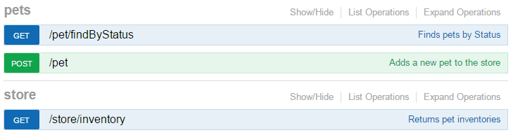

## Grouping Operations With Tags

You can assign a list of `tags` to each API operation. Tagged operations may be handled differently by tools and libraries. For example, Swagger UI uses `tags` to group the displayed operations.

```
paths:
  /pet/findByStatus:
    get:
      summary: Finds pets by Status
      tags:
        - pets
      ...
  /pet:
    post:
      summary: Adds a new pet to the store
      tags:
        - pets
      ...
  /store/inventory:
    get:
      summary: Returns pet inventories
      tags:
        - store
      ...
```



Optionally, you can specify `description` and `externalDocs` for each tag by using the global `tags` section on the root level. The tag names here should match those used in operations.

```
tags:
  - name: pets
    description: Everything about your Pets
    externalDocs:
      url: http://docs.my-api.com/pet-operations.htm
  - name: store
    description: Access to Petstore orders
    externalDocs:
      url: http://docs.my-api.com/store-orders.htm
```

The tag order in the global tags section also controls the default sorting in Swagger UI.

Note that it is possible to use a tag in an operation even if it is not defined on the root level.
